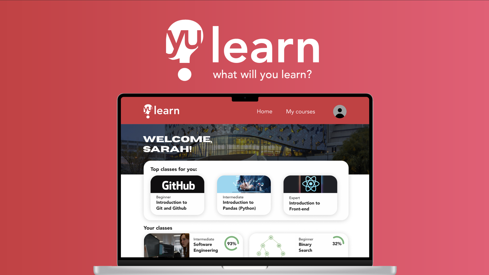

# YULearn - AI-Powered Learning Platform for CS and SWE Students

## Overview
**YULearn** is an AI-powered platform designed to bridge the gap between academia and industry expectations for CS and SWE students. It provides personalized, industry-relevant content to help students prepare for real-world roles, focusing on practical skills missing in traditional coursework.

## Problem
Many students at York University and beyond struggle with industry-level concepts like 'CI/CD pipelines,' 'API integrations,' and 'cloud computing' — skills essential for entry-level jobs but not covered in their coursework. This leaves them feeling unprepared for their careers.

## Solution
**YULearn** combines an interactive, Udemy-style platform with a fine-tuned AI language model to deliver personalized learning paths. It provides self-paced, practical, industry-focused content, helping students gain the skills they need to succeed in their careers.

### Key Features:
- **Personalized Learning Paths** powered by AI.
- **Interactive Content** for diverse learning styles.
- **Industry-Relevant Knowledge** covering real-world skills.
- **Self-Hosted & Secure** infrastructure for data privacy.

## Technologies
- **Next.js** for server-rendered React apps.
- **Neon PostgreSQL** for scalable cloud storage.
- **Drizzle ORM** for type-safe database interaction.
- **Clerk** for authentication and user management.
### Other
- **Python**, **Pandas**, and **Plotly** to render out graph data about York University statistics for business pitch 

